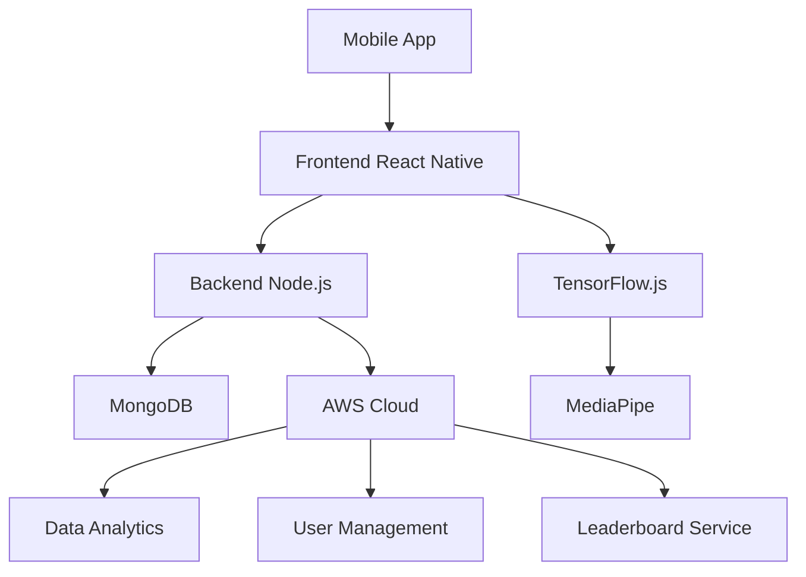

# SMART INDIA HACKATHON 2024

- Problem Statement ID: [To be filled by the team]
- Problem Statement 
- Theme: Healthcare & Fitness
- PS Category: Software
- Team ID: [To be filled by the team]
- Team Name: [To be filled by the team]

## IDEA TITLE: AI-Powered Inclusive Fitness Companion

### Proposed Solution

- An AI-powered fitness assistant using MediaPipe for pose estimation and workout counting
- Real-time AI correction based on body angles, provided through speech and text
- Features weekly rankings and giveaways to encourage consistent participation
- Allows progress sharing within the app's social network

Innovation:
- Combines pose estimation, real-time feedback, and social features
- Inclusive design for users with visual or hearing impairments
- Gamification elements to boost motivation and adherence

## TECHNICAL APPROACH

Technologies:
- Frontend: React Native for cross-platform mobile development
- Backend: Node.js with Express.js
- AI: TensorFlow.js, MediaPipe for pose estimation
- Database: MongoDB
- Cloud: AWS for scalable infrastructure

Methodology:
1. User registration and profile creation
2. Workout selection and difficulty setting
3. Camera-based pose estimation using MediaPipe
4. Real-time form correction using angle analysis
5. Rep counting and workout completion tracking
6. Progress data storage and analysis
7. Social sharing and leaderboard updates

[Diagram: System Architecture]

## FEASIBILITY AND VIABILITY

Feasibility:
- Leverages existing open-source technologies (MediaPipe, TensorFlow.js)
- Cross-platform development reduces time-to-market
- Scalable cloud infrastructure ensures performance as user base grows

Challenges:
1. Ensuring accuracy of pose estimation across diverse body types
2. Providing real-time feedback with minimal latency
3. Protecting user privacy and data security
4. Developing an inclusive interface for users with different abilities

Mitigation Strategies:
1. Extensive testing with diverse user groups
2. Optimize algorithms and use edge computing where possible
3. Implement strong encryption and follow data protection regulations
4. Collaborate with accessibility experts and conduct user testing

## IMPACT AND BENEFITS

Target Audience Impact:
- Increased accessibility to fitness guidance for people with disabilities
- Improved workout form and reduced risk of injury for all users
- Enhanced motivation through social features and gamification

Benefits:
- Social: Promotes inclusive fitness and community building
- Health: Encourages regular exercise and proper form
- Economic: Reduces need for in-person trainers, making fitness guidance more affordable
- Technological: Advances the application of AI in personal health and fitness

## RESEARCH AND REFERENCES

1. MediaPipe Pose: https://google.github.io/mediapipe/solutions/pose
2. TensorFlow.js: https://www.tensorflow.org/js
3. "The Effects of Gamification on Physical Activity: A Systematic Review" - DOI: 10.1177/1357633X20938480
4. "Accessibility of Fitness Applications: An Analysis of Current Trends" - [Link to be added by team]
5. "AI in Healthcare: Enhancing Patient Outcomes Through Technology" - [Link to be added by team]
